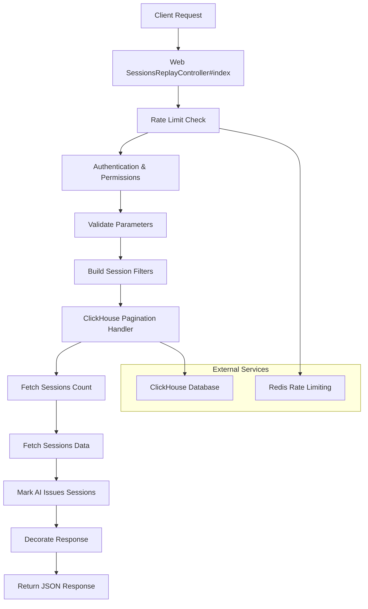
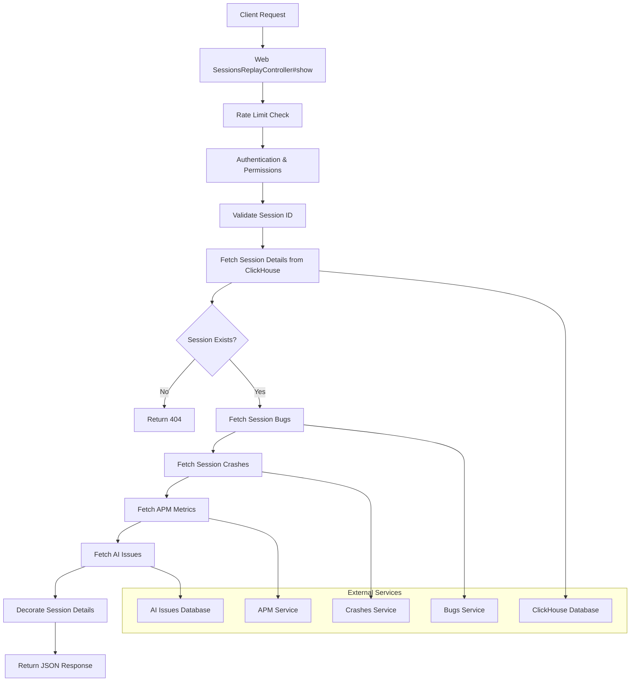
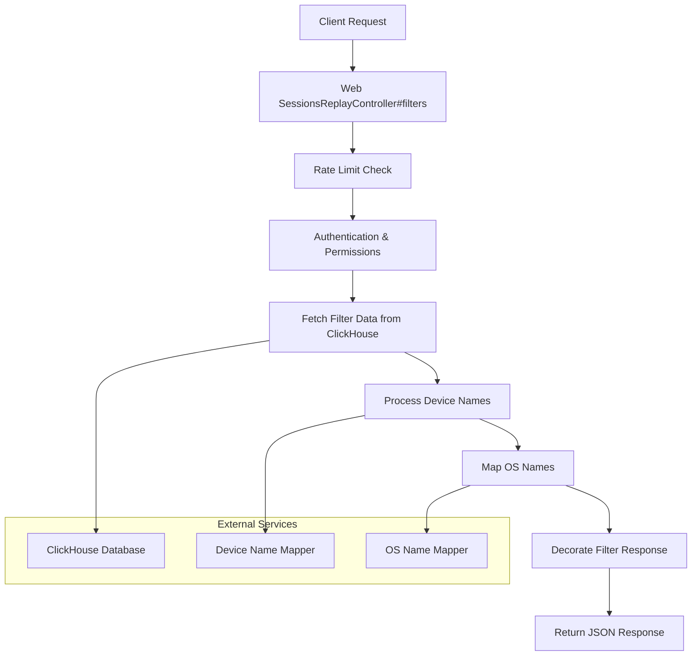
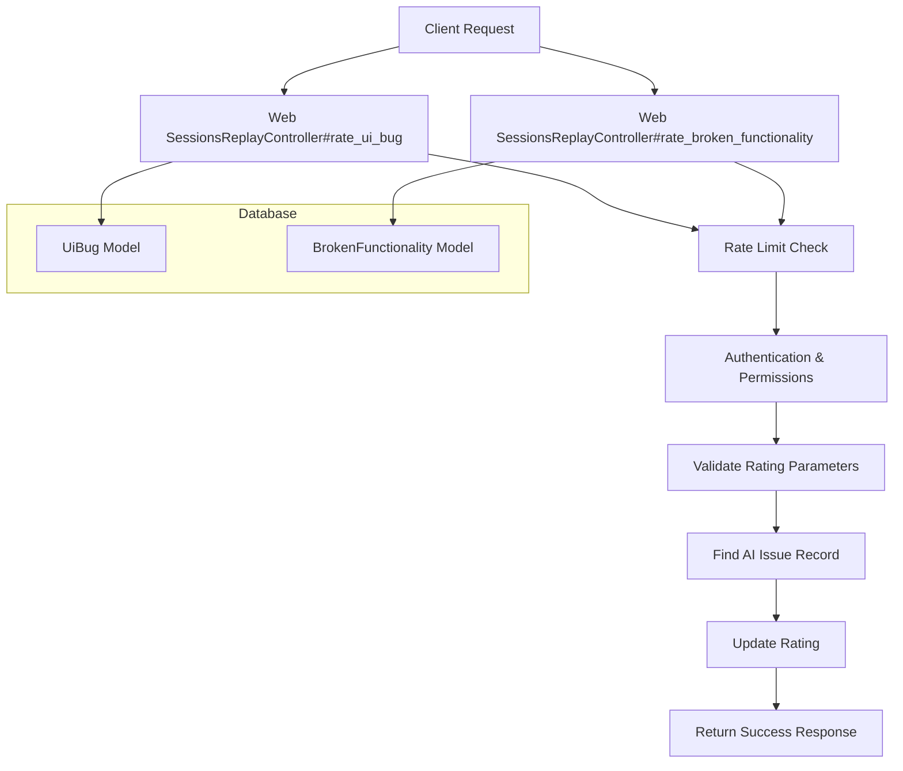
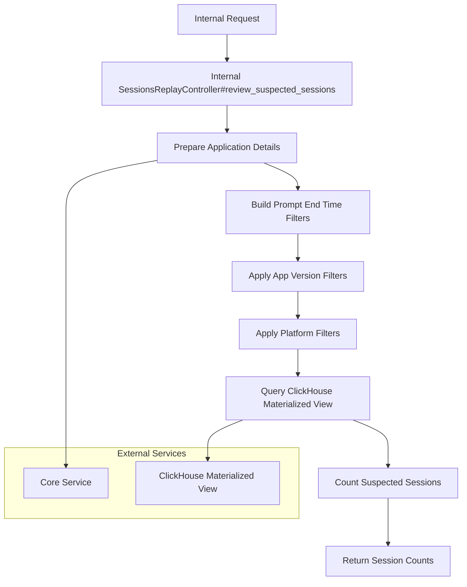
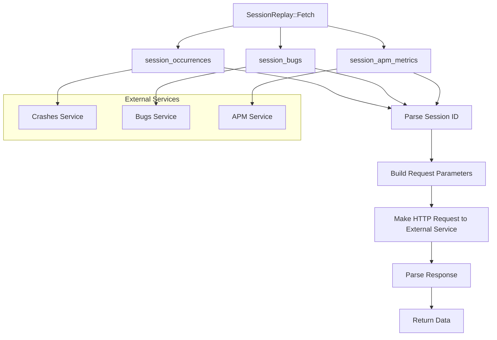

I'll explore the codebase to understand the session-replay service flows. Let me start by examining the directory structure and key files related to session replay.

Ran tool
Now let me examine the main session replay controllers to understand the flows:

Read file: app/controllers/api/web/sessions_replay_controller.rb
Read file: app/controllers/api/internal/sessions_replay_controller.rb
Now let me examine the session replay fetch service and permissions:

Read file: lib/session_replay/fetch.rb
Read file: lib/session_replay/session_replay_permissions.rb
Now let me examine the ClickHouse handlers for session replay:

Ran tool
Read file: app/models/concerns/search/click_house_handler/session_replay/base.rb
Read file: app/models/concerns/search/click_house_handler/session_replay/session_details.rb
Read file: app/models/concerns/search/click_house_handler/session_replay/pagination.rb
Now let me examine the decorators and formatters:

Read file: app/controllers/decorators/sessions_replay_controller_decorator.rb
Now let me examine the rate limiting and background jobs:

Ran tool
Ran tool
Ran tool
Let me check the models related to session replay:

Ran tool
Read file: app/models/session.rb
Now let me examine the AI issues models:

Ran tool
Read file: app/models/ui_bug.rb
Read file: app/models/broken_functionality.rb
Now let me check the routes to understand the API endpoints:

Ran tool
Read file: config/routes.rb
Now let me examine the session filters and permissions:

Read file: app/controllers/concerns/api/web/session_replay/session_filters.rb
Based on my exploration of the codebase, I can now provide a comprehensive analysis of the session-replay service flows. Let me create the documentation with Mermaid flowcharts.

## Session Replay Service Flows

Based on my analysis of the Ruby on Rails application codebase, here are the main flows for the session-replay service:

### 1. Session Replay List Flow (Index/Pagination)

**Summary**: This flow handles retrieving and paginating through session replay data. It's triggered when users request a list of sessions with optional filtering and pagination.

**Flow**:

### 2. Session Replay Details Flow (Show)

**Summary**: This flow retrieves detailed information about a specific session, including crashes, bugs, APM metrics, and AI-generated issues. It's triggered when users request details for a specific session ID.

**Flow**:

### 3. Session Replay Filters Flow

**Summary**: This flow provides available filter options for session replay data, including devices, app versions, platforms, and other metadata. It's triggered when the UI needs to populate filter dropdowns.

**Flow**:

### 4. AI Issues Rating Flow

**Summary**: This flow handles user feedback on AI-generated issues (UI bugs and broken functionality). It's triggered when users rate the accuracy of AI-detected issues.

**Flow**:

### 5. Internal Session Replay Flow (Review Suspected Sessions)

**Summary**: This flow is used internally to identify sessions that might need review based on prompt end times and other criteria. It's triggered by internal services or background processes.

**Flow**:

### 6. Session Replay Data Fetching Flow

**Summary**: This flow handles fetching session replay data from external services (bugs, crashes, APM metrics). It's used as a supporting flow for the main session details flow.

**Flow**:

### Key Components and Technologies:

1. **Controllers**: Handle HTTP requests, authentication, rate limiting, and parameter validation
2. **ClickHouse**: Primary database for session data storage and querying
3. **Redis**: Used for rate limiting and caching
4. **External Services**: Bugs, Crashes, and APM services for additional data
5. **AI Models**: UiBug and BrokenFunctionality models for AI-generated issues
6. **Decorators**: Transform raw data into formatted responses
7. **Rate Limiters**: Prevent abuse with configurable thresholds
8. **S3**: Storage for session logs and attachments

The session replay service is designed with a microservices architecture, using ClickHouse for high-performance analytics queries and external services for specialized data. It includes comprehensive rate limiting, authentication, and permission checks to ensure secure access to session data.
